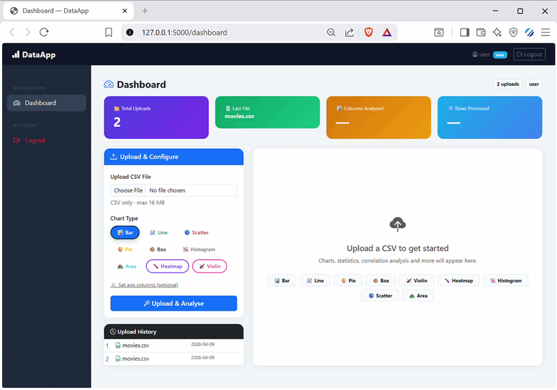

# DataApp — File-Based Flask Data Platform

> ✅ No MySQL. No database setup. No migrations. Just upload a CSV and go.

---
## 🎥 Demo Preview



## 🚀 Start in 2 Steps

```bash
# 1. Install
pip install -r requirements.txt

# 2. Run
python app.py
```

Visit: **http://localhost:5000**

That's it. Users are stored in `data/users.json`. Uploads land in `uploads/`.

---

## 🗂 Project Structure

```
data_app/
├── app.py           # Flask app + all routes
├── user_store.py    # JSON-file user storage (replaces SQL)
├── forms.py         # WTF forms (Register, Login, Upload)
├── utils.py         # Cleaning, metrics, chart generation
├── .env             # App secrets
├── .env.example     # Template
├── requirements.txt
├── data/
│   └── users.json   # Auto-created on first register
├── uploads/         # CSV files stored here
├── templates/
│   ├── base.html
│   ├── login.html
│   ├── register.html
│   ├── dashboard.html
│   ├── admin.html
│   ├── 403.html
│   └── 404.html
└── tests/
    └── test_app.py
```

---

## 🔒 Creating an Admin User

After starting the app, register normally at `/register`, then open `data/users.json`
and change `"role": "user"` to `"role": "admin"` for your account. Save the file.

---

## 🧪 Run Tests

```bash
pytest tests/ -v
```

---

## 📊 Features

| Feature | How it works |
|---|---|
| Auth | Register/Login/Logout via Flask-Login |
| Storage | Users in `data/users.json`, files in `uploads/` |
| Upload | CSV only, max 16 MB, validated |
| Cleaning | Normalize columns, fill NAs, drop duplicates |
| Charts | Bar / Line / Scatter — Plotly (interactive) + Matplotlib (static) |
| Admin | View all users and uploads |
| Security | bcrypt passwords, CSRF tokens, role-based access |
